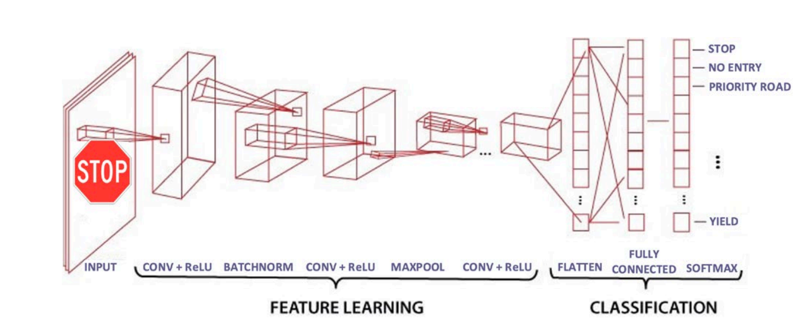
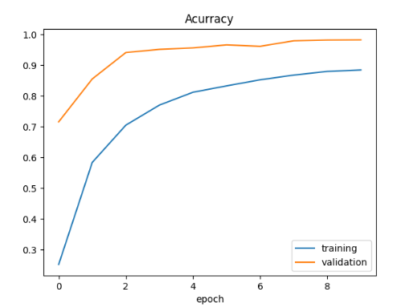
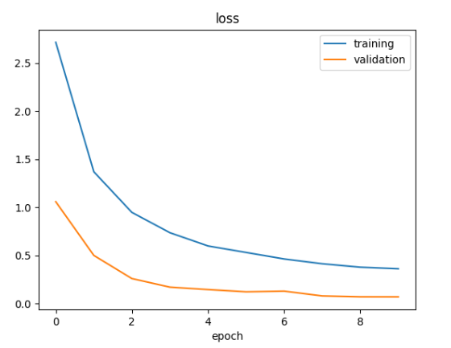
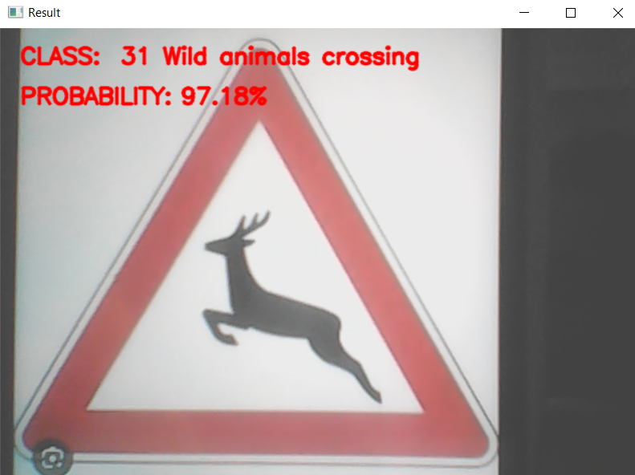
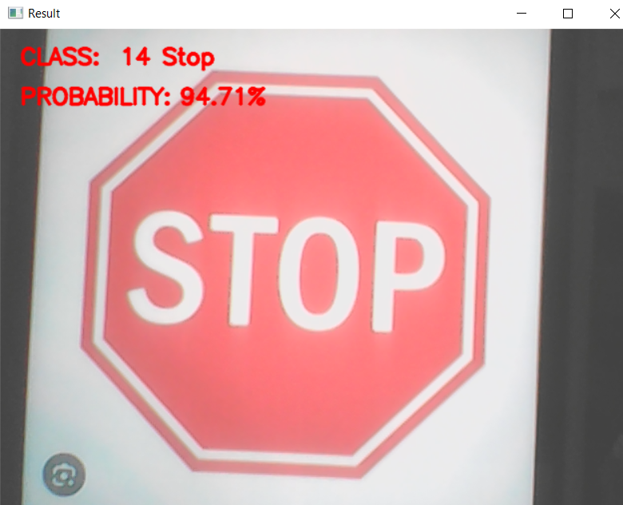

# Using-Convolutional-Neural-Networks-for-Traffic-Sign-Classification
## Dataset

The dataset used for this project was obtained from Kaggle. The dataset can be accessed at the following link:

[German Traffic Sign Dataset]([kaggle.com/link/to/dataset](https://www.kaggle.com/datasets/harbhajansingh21/german-traffic-sign-dataset/code))

## Traffic Sign Detection and Classification

This project involves the development of an automatic system that detects and classifies traffic sign panels. Python, TensorFlow, and Keras, which are widely used in the field, were employed as programming tools.

### Objective
This work represents a significant step towards enhancing the reliability and efficiency of autonomous driving systems.

### Methodology
The combination of deep learning and image processing techniques provides an effective tool for accurately recognizing and classifying traffic signs.

### Impact
Enhancing safety and improving the driving experience are key outcomes of this work.

  
  
<em>Applied classification layer structure</em>

## Table 1: Layer Types and Output Shapes

| Layer (Type)       | Output Shape    | Parameter Count |
|--------------------|-----------------|-----------------|
| conv2d (Conv2D)    | (None, 28, 28, 60) | 1,560           |
| conv2d 1 (Conv2D)  | (None, 24, 24, 60) | 90,060          |
| max pooling2d (MaxPooling2D) | (None, 12, 12, 60) | 0           |
| conv2d 2 (Conv2D)  | (None, 10, 10, 30) | 16,230          |
| conv2d 3 (Conv2D)  | (None, 8, 8, 30)   | 8,130           |
| max pooling2d 1 (MaxPooling2D) | (None, 4, 4, 30) | 0            |
| dropout (Dropout)  | (None, 4, 4, 30)   | 0               |
| flatten (Flatten)  | (None, 480)       | 0               |
| dense (Dense)      | (None, 500)       | 240,500         |
| dropout 1 (Dropout)| (None, 500)       | 0               |
| dense 1 (Dense)    | (None, 43)        | 21,543          |

## Results

The results obtained on the test set demonstrate that the model can accurately classify traffic signs. However, further testing is required to evaluate the performance under real-world conditions.

  

    
    
<em></em>

  

  

    
    
<em></em>

  

## Test Results

| Metric         | Score            |
|----------------|------------------|
| Test Score     | 0.0619           |
| Test Accuracy  | 0.9845           |

## Images from the project

  

    
    
<em></em>

  

  

    
    
<em></em>

  

Various experiments have been conducted on different traffic signs.
